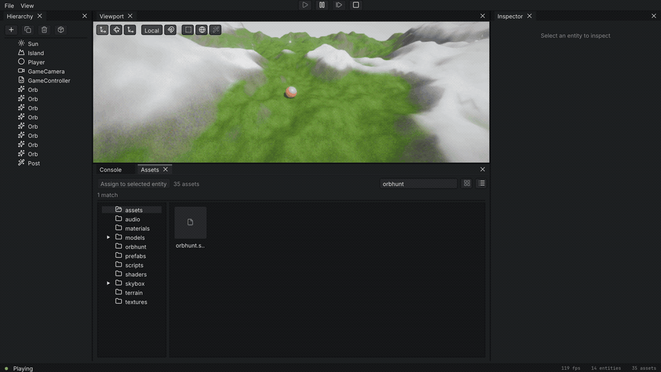
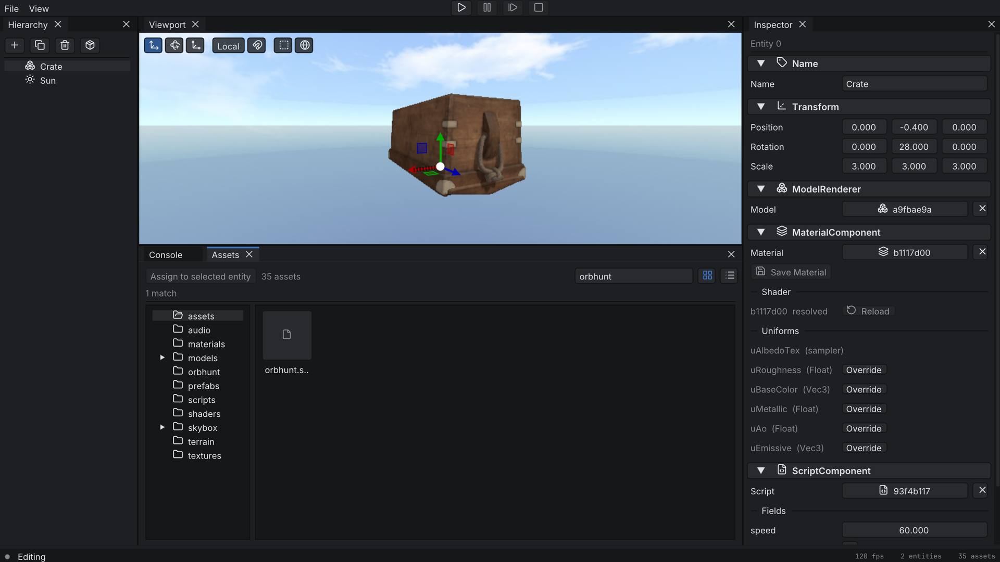

<div align="center">

# Rabbet

**A from-scratch C++ game engine**

[](LICENSE)
[](https://en.cppreference.com/)
[](https://www.opengl.org/)
[](#platform-support)

</div>

---

Rabbet is a 3D engine I'm building from scratch in C++. It's a sparse-set ECS with a modern
OpenGL renderer and an editor called `forge` on top.

## Showcase

<p align="center">
  
</p>
<p align="center">
  
</p>

## Features

- **ECS core.** Sparse-set entities with versioned handles over dense component pools, run by a small system-and-resource runtime. Systems are tagged Always or Play, so gameplay code only ticks between Play and Stop.
- **Renderer.** An OpenGL 4.1 forward path with metallic-roughness PBR and a Phong fallback. There are directional, point and spot lights, shadow maps, emissive surfaces and optional image-based lighting, plus a post stack (bloom, tone mapping, FXAA), CPU particles, and heightmap or noise terrain.
- **Editor (`forge`).** A dockable ImGui workspace around a render-to-texture viewport, with click-to-pick, gizmo handles with snapping, and Play/Pause/Step/Stop that snapshots the scene and restores it on Stop. The asset browser draws live thumbnails, and the hierarchy is a real tree you reparent by dragging.
- **Content is data.** Every asset carries a stable UUID and an `.import` sidecar. Models (glTF, OBJ, FBX), textures, audio, materials, shaders and prefabs are all first-class, and scenes save to readable JSON. Prefabs can capture and rebuild whole entity subtrees, not just single objects.
- **Scripting.** Lua behaviour through sol2, with live hot-reload and inspector-editable fields. Scripts get an entity and world API to find other entities, spawn and destroy prefabs, and move physics bodies.
- **Physics and audio.** Jolt rigidbodies with box, sphere and terrain-mesh colliders, advanced at a fixed timestep. Audio is miniaudio, with spatial emitters placed from the active camera.
- **Tested.** 45 headless CTest suites, and the engine and editor build clean under `-Werror` in Debug and Release.

A small demo game, Orb Hunt, lives under `examples/forge/assets/orbhunt` and runs from the
editor. Load the scene, hit Play, and roll the ball around collecting orbs.

## Quick start

```sh
git clone https://github.com/Adel-Ayoub/Rabbet.git
cd Rabbet

cmake -S . -B build          # configures and fetches dependencies
cmake --build build -j       # builds the engine, editor, examples and tests
./build/bin/forge            # launch the editor
```

Requires **CMake 3.24+** and a **C++20** compiler. Dependencies are fetched and built from
pinned sources on first configure; a few single-header libraries are vendored in-tree under
`third_party/`.

## Build

| Command                  | Description                              |
| ------------------------ | ---------------------------------------- |
| `cmake -S . -B build`    | Configure (fetches dependencies)         |
| `cmake --build build -j` | Build engine, editor, examples and tests |
| `./build/bin/forge`      | Launch the editor                        |
| `ctest --test-dir build` | Run the test suite                       |

Options: `-DCMAKE_BUILD_TYPE=Release`, `-DRABBET_BUILD_EDITOR=OFF`, `-DRABBET_BUILD_TESTS=OFF`.

## Platform support

| Platform | Support   |
| -------- | --------- |
| macOS    | Supported |
| Linux    | Supported |

## Acknowledgements

Built on excellent open-source libraries: [GLFW](https://www.glfw.org/), [GLM](https://github.com/g-truc/glm), [Dear ImGui](https://github.com/ocornut/imgui) + [ImGuizmo](https://github.com/CedricGuillemet/ImGuizmo), [assimp](https://github.com/assimp/assimp), [nlohmann/json](https://github.com/nlohmann/json), [Lua](https://www.lua.org/) + [sol2](https://github.com/ThePhD/sol2), [Jolt Physics](https://github.com/jrouwe/JoltPhysics), [miniaudio](https://github.com/mackron/miniaudio), [stb](https://github.com/nothings/stb) and [glad](https://github.com/Dav1dde/glad). The sample crate model is from [Poly Haven](https://polyhaven.com/) (CC0). The editor bundles the [Inter](https://rsms.me/inter/) and [JetBrains Mono](https://www.jetbrains.com/lp/mono/) typefaces (OFL) and icon glyphs from [Lucide](https://lucide.dev/) (ISC).

## License

Apache License 2.0 — Copyright (c) 2026 Adel-Ayoub. See [LICENSE](LICENSE).
